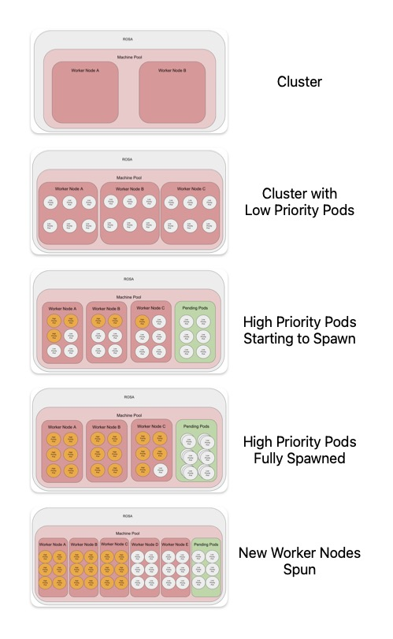
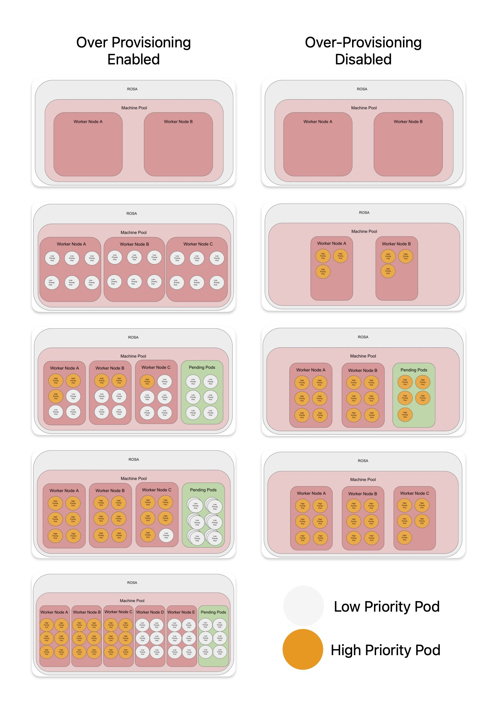
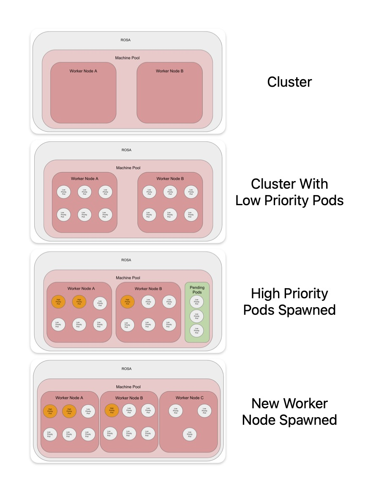

# Over Provisioning Red Hat Openshift on AWS

There might be occasions where over provisioning your cluster will provide great benefit.
If there are sudden bursts of pods being created in a short amount of time, there can be situations where a new node is spinning up but is not ready. This can cause issues as pods will stuck in a pending phase for around 10 minutes whilst waiting for the new node. 

A solution to this is to over provision your cluster. 
this enables a spare node at all times, or pre-emptily create a new node when the workflow starts to pick up.

## Use Cases

With this solution, pods are created that are considered low priority. When the more important workloads are created, the low priority pods get removed from the nodes.
This leaves the low priority pods in a pending state. This forces Openshift to spawn a new node to accommodate the pending pods. Creating capacity for future High-priority pods without waiting for a new node.

#### Spare Node

In this use case, the aim is to have spare nodes all the time. Typically, Workloads are coming in faster than a node is spawned. An example might be large number of developers logging in the Red Hat OpenShift Dev Spaces at the beginning of their shifts



At the start there is only 2 worker nodes.
With the spare pod solution, there can be a additional node at all times. 
This is done by controlling the number of low-priority pod replicas (see Controlling the number of replicas, below).

When the real/high-priority workload starts, it forces the low-priority pods out of the nodes.
The low priority pods are then stuck in pending, as it is unschedulable. 
This forces the auto scaler to spin up a new node. Giving room to have even more workload in the additional nodes.

Comparing not having this solution


#### Pick Up Workflow

This workflow is designed to up the cluster when workloads starts to come in. The workloads might come in a slower, but prefer to have a spare node ready rather than waiting for a new node. 



There are 2 nodes when the cluster started, the nodes are then filled with low priority pods. 
When the real/high-priority workload starts, it forces the low-priority pods out of the nodes.
The low priority pods is then stuck in pending, as it is unschedulable. 
This forces the auto scaler to spin up a new node. Giving room to have even more workload in the additional nodes.


## Pre requisites

This article assumes a basic knowledge of the OpenShift command-line interface `oc`. 
A running instance of OpenShift 4 on `ROSA` and admin access on the OpenShift cluster. 
Access to the OpenShift web console and access to your cluster on `console.redhat.com`. 

## Setup

#### Cluster Setup

Login to `console.redhat.com` and navigate to the cluster.

Go to the Machine Pool tab

Create a new machine pool or select a pre-existing machine pool and turn on the auto-scaler (if it not enabled). 

If using multiple Machine Pools, consider labeling it, so that the deployments can be fixed to a certain machine pool.

#### Create Project

Creating a new namespace on OpenShift.
```
oc new project over-provision
```

#### Create a Priority Class

The Priority class dictates how important a pod compared to other pods. A lower priority would cause the scheduler will evict the pods, to allow the schedule of higher priority pods. By default most pods have a priority of 0.
Creating a new `PriorityClass` to allows the pods to be evicted, when more important workloads are created.

Create a new priority class on your OpenShift Cluster. 

```
apiVersion: scheduling.k8s.io/v1
kind: PriorityClass
metadata:
  name: overprovisioning
value: -10
globalDefault: false
description: "Priority class used by overprovisioning."
```

#### Deploy the Low Priority pods

Create the low priority pods using this deployment:

```
apiVersion: apps/v1
kind: Deployment
metadata:
  name: overprovisioning
  namespace: over-provision
spec:
  replicas: 15
  selector:
    matchLabels:
      run: overprovisioning
  template:
    metadata:
      labels:
        run: overprovisioning
    spec:
      priorityClassName: overprovisioning
      terminationGracePeriodSeconds: 0
      nodeSelector:
        scale: "true"
      containers:
        - name: reserve-resources
          image: registry.k8s.io/pause:3.9
          resources:
            requests:
              cpu: "350m"
```

Apply deployment using `oc apply -f <low-priority-pods.yaml>`

There are two items that should be changed for your use case, the number of `replicas` and the `CPU` requests.
The CPU requests value should be set to an average of your workload CPU requests, this can help provide a estimate for predetermined sudden load. 
For example if your sudden load peak is 10 pods, all consuming ~`350m` CPU, setting the number of replicas and CPU will allow your cluster to have room for the sudden load peak.

### Controlling the number of replicas

This is a very important step, the number of replicas is key. there are two options to control it.

#### Manual

The easiest method is to manually control the number of replicas. it can be set to a value of a known sudden load or a value where the cluster if forced to create a new node.
This can be done using the deployment, or by increasing the number of replicas using the UI or CLI.
`oc scale deployment overprovisioning -n over-provision --replicas=20`

#### Auto Scaler

The other option is to use the `cluster-proportional-autoscaler`.
The auto scaler dynamically controls the number of replicas, using a criteria set using a config map called `overprovisioning-autoscaler`, with the values set in the `default-params` section. This means that within a set parameter it will scale accordingly. The auto scaler works in proportion to your cluster, looking at number of CPU cores, Number of nodes and etc. 


```
kind: ServiceAccount
apiVersion: v1
metadata:
  name: cluster-proportional-autoscaler-example
  namespace: over-provision
---
kind: ClusterRole
apiVersion: rbac.authorization.k8s.io/v1
metadata:
  name: cluster-proportional-autoscaler-example
rules:
  - apiGroups: [""]
    resources: ["nodes"]
    verbs: ["list", "watch"]
  - apiGroups: [""]
    resources: ["replicationcontrollers/scale"]
    verbs: ["get", "update"]
  - apiGroups: ["extensions","apps"]
    resources: ["deployments/scale", "replicasets/scale"]
    verbs: ["get", "update"]
  - apiGroups: [""]
    resources: ["configmaps"]
    verbs: ["get", "create"]
---
kind: ClusterRoleBinding
apiVersion: rbac.authorization.k8s.io/v1
metadata:
  name: cluster-proportional-autoscaler-example
subjects:
  - kind: ServiceAccount
    name: cluster-proportional-autoscaler-example
    namespace: overprovision
roleRef:
  kind: ClusterRole
  name: cluster-proportional-autoscaler-example
  apiGroup: rbac.authorization.k8s.io
```
```
apiVersion: apps/v1
kind: Deployment
metadata:
  name: overprovisioning-autoscaler
  namespace: over-provision
  labels:
    app: overprovisioning-autoscaler
spec:
  selector:
    matchLabels:
      app: overprovisioning-autoscaler
  replicas: 1
  template:
    metadata:
      labels:
        app: overprovisioning-autoscaler
    spec:
      containers:
        - image: registry.k8s.io/cluster-proportional-autoscaler-amd64:1.8.1
          name: autoscaler
          command:
            - /cluster-proportional-autoscaler
            - --namespace=overprovision
            - --configmap=overprovisioning-autoscaler
            - --default-params={"linear":{"coresPerReplica":1}}
            - --target=deployment/overprovisioning
            - --logtostderr=true
            - --v=2
      serviceAccountName: cluster-proportional-autoscaler-example
```
The autoscaler creates a config map called `overprovisioning-autoscaler` with the values set in the `default-params` section.
There are multiple params that can be set including a minimum and maximum number of replicas. 

`coresPerReplica` is an important value, leaving it as the default 1 would not allow the cluster autoscaler to scale down. It's best to increase this value to above 1. `1.2` would be great starting place. Combining it with a minimum value allows a spare node to be running at all times, if required. 

More information and configuration can be found here : https://github.com/kubernetes-sigs/cluster-proportional-autoscaler#control-patterns-and-configmap-formats

## Testing

To test the scaling simply create a deployment and increase the number of replicas using the UI or running `oc scale --replicas=15 deployment high-priority-pod`

```
apiVersion: apps/v1
kind: Deployment
metadata:
  labels:
    app: high-priority-pod
  name: high-priority-pod
  namespace: over-provision
spec:
  replicas: 3
  selector:
    matchLabels:
      app: high-priority-pod
  template:
    metadata:
      labels:
        app: high-priority-pod
    spec:
      containers:
        - image: image-registry.openshift-image-registry.svc:5000/openshift/httpd
          name: httpd
          ### Not needed, purely for demo purposes
          resources:
            requests:
              cpu: "350m"
```

## Conclusion

There are pros and cons to this solution, an increase in costs as there will have more node vs nodes being ready to use at any given time. 
It might not be for everyone, when the solution was tested, the decreased wait time for Red Hat Dev Spaces was beneficial. It would allow for users to login and start working faster rather than being forced to wait 10 minutes for a new node to spin up and be ready. If your workflow is peaky, for example users login in at 9AM, this solution might benefit your use case. It will require tailoring for your environment and use case but will hopefully be beneficial


### References

https://github.com/kubernetes-sigs/cluster-proportional-autoscaler
