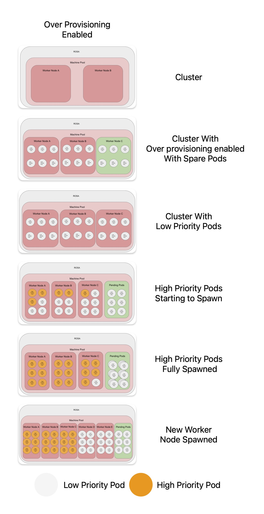

# Over Provisioning Red Hat Openshift on AWS

There might be occasions where over provisioning your cluster will provide great benefit .
If you experience sudden bursts of pods being created in a short amount of time, you can find your self in a situation where you have to wait for a new node to spin up. This can cause issues as you will have pods being stuck in a pending phase for around 10 minutes whilst you wait for the new node. 

What you might want to do is have over provision your cluster. 
You can have a spare node at all times, or pre-emptily create a new node when the workflow starts to pick up.

## Use Cases

With this solution, you create pods that are considered low priority. When the more important workloads are created, the low priority pods get removed from the nodes.
This leaves the low priority pods in a pending state. This forces Openshift to spawn a new node to accommodate the pending pods. Creating capacity for future High-priority pods without waiting for a new node.

#### Spare Node

In this use case, the aim is to have spare nodes all the time. Typically, Workloads are coming in faster than a node is spawned. An example might be developers spinning up workloads at 9AM when using Red Hat Dev Spaces. 



As you can see, we initially start out with only 2 worker nodes.
With the spare pod solution, we can have a additional node at all times.

When the real/high-priority workload starts, it forces the low-priority pods out of the nodes.
The low priority pods are then stuck in pending, as it is unschedulable. 
This forces the auto scaler to spin up a new node. Giving you room to have even more workload in the additional nodes.

#### Pick Up Workflow

This workflow is designed to up the cluster when workloads starts to come in. The workloads might come in a slower, but you might prefer to have a node ready rather than waiting for a new node.   


We have 2 nodes with the cluster to start, the nodes are then filled with low priority pods. 
When the real/high-priority workload starts, it forces the low-priority pods out of the nodes.
The low priority pods is then stuck in pending, as it is unschedulable. 
This forces the auto scaler to spin up a new node. Giving you room to have even more workload in the additional nodes.


## Pre requisites

This article assumes you have a basic knowledge of the OpenShift command-line interface `oc`. 
You need a running instance of OpenShift 4 on `ROSA` and admin access on the OpenShift cluster. 
Access to the OpenShift web console and access to your cluster on `console.redhat.com`. 

## Setup

#### Cluster Setup

Login to `console.redhat.com` and go to your cluster.

Go to the Machine Pool tab

Create a new machine pool or select a pre-existing machine pool and turn on the auto-scaler (if it not enabled). 

If using multiple Machine Pools, I would recommend that you label it, so you can have the deployments fixed to a certain machine pool.

#### Create Project

Creating a new namespace on OpenShift.
```
oc new project over-provision
```

#### Create a Priority Class

The Priority class dictates how important a pod compared to other pods. A lower priority would cause the scheduler will evict the pods, to allow the schedule of higher priority pods. By default most pods have a priority of 0.
We are creating a new `PriorityClass` to allow our pods to be evicted, when more important workloads are created.

Create a new priority class on your OpenShift Cluster. 

```
apiVersion: scheduling.k8s.io/v1
kind: PriorityClass
metadata:
  name: overprovisioning
value: -10
globalDefault: false
description: "Priority class used by overprovisioning."
```

#### Deploy the Low Priority pods

Create the low priority pods using this deployment:

```
apiVersion: apps/v1
kind: Deployment
metadata:
  name: overprovisioning
  namespace: over-provision
spec:
  replicas: 15
  selector:
    matchLabels:
      run: overprovisioning
  template:
    metadata:
      labels:
        run: overprovisioning
    spec:
      priorityClassName: overprovisioning
      terminationGracePeriodSeconds: 0
      nodeSelector:
        scale: "true"
      containers:
        - name: reserve-resources
          image: registry.k8s.io/pause:3.9
          resources:
            requests:
              cpu: "350m"
```

Apply deployment using `oc apply -f <low-priority-pods.yaml>`

There are two items that should be changed for your use case, the number of `replicas` and the `CPU` requests.
The CPU requests value should be set to an average of your workload cpu requests, this will allow you to estimate and set a predetermined sudden load. 
For example if your sudden load peak is 10 pods, all consuming ~`350m` CPU, you can use the number of replicas and the CPU to set this value. this will allow your cluster to have room for the sudden load peak.

### Controlling the number of replicas

This is a very important step, the number of replicas is key. We have two options to control it.

#### Manual

The easiest method is to manually control the number of replicas. We can set it to a value of what we expect as a sudden load or a value where the cluster if forced to create a new node.
This can be done using the deployment, or by increasing the number of replicas using the UI or CLI.
`oc scale deployment overprovisioning -n over-provision --replicas=20`

#### Auto Scaler

The other option is to use the `cluster-proportional-autoscaler`.
The auto scaler dynamically controls the number of replicas. This means that within a set parameter it will scale accordingly.

```
apiVersion: apps/v1
kind: Deployment
metadata:
  name: overprovisioning-autoscaler
  namespace: over-provision
  labels:
    app: overprovisioning-autoscaler
spec:
  selector:
    matchLabels:
      app: overprovisioning-autoscaler
  replicas: 1
  template:
    metadata:
      labels:
        app: overprovisioning-autoscaler
    spec:
      containers:
        - image: registry.k8s.io/cluster-proportional-autoscaler-amd64:1.8.1
          name: autoscaler
          command:
            - /cluster-proportional-autoscaler
            - --namespace=overprovision
            - --configmap=overprovisioning-autoscaler
            - --default-params={"linear":{"coresPerReplica":1}}
            - --target=deployment/overprovisioning
            - --logtostderr=true
            - --v=2
      serviceAccountName: cluster-proportional-autoscaler-example

```

The autoscaler creates a config map called `overprovisioning-autoscaler` with the values set in the `default-params` section.
There are multiple params that we can set including a minimum and maximum number of replicas. 

`coresPerReplica` is an important value, leaving it as the default 1 would not allow the cluster autoscaler to scale down. I found it best to increase this value to above 1. I've had success with `1.2`, this would be great starting place. Combining it with a minimum value allow you to increase this value to have a spare node running if you need it. 

More information and configuration can be found here : https://github.com/kubernetes-sigs/cluster-proportional-autoscaler#control-patterns-and-configmap-formats

## Conclusion

There are benefits and negatives to this solution, an increase in costs as you will have more node vs nodes being ready to use at any given time. 
It might not be for everyone, when i tested the solution the decreased wait time for Red Hat Dev Spaces was beneficial. It would allow our users to login and start working faster rather than being forced to wait 10 minutes for a new node to spin up and be ready. If you have peaky workflow, for example users login in at 9AM, this solution might work for you. It will require tailoring for your environment and use case but will hopefully be beneficial


### References

https://github.com/kubernetes-sigs/cluster-proportional-autoscaler
